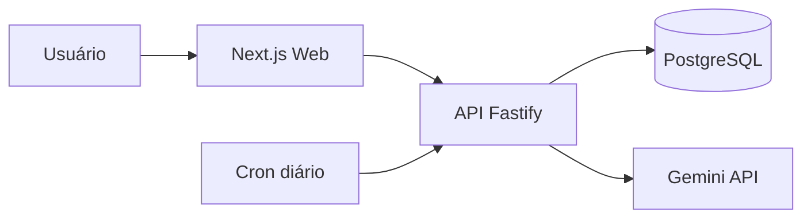

# README Generator — Projetos (tavinholoco)

Arquivo de instruções para o Claude Code. Coloque este arquivo na raiz do repositório
e inicie a sessão com:

> Leia `README-GENERATOR.md` e execute o procedimento nele para este repositório.

Objetivo: gerar `README.md` (inglês) e `README.pt-BR.md` (português) padronizados,
consistentes entre todos os repositórios do perfil, sem inventar informação.

Regras globais que valem para tudo neste arquivo:

- **Sem emoji.** Em nenhum lugar do README, incluindo títulos e listas.
- **Nada inventado.** Toda afirmação sobre stack, comandos, features ou deploy precisa
  vir de um arquivo real do repositório. O que não for verificável vira pergunta ao Pedro
  ou é omitido — nunca preenchido com suposição.
- **Tom profissional e direto.** Frases curtas, voz ativa, sem marketing vazio
  ("solução inovadora", "poderoso", "revolucionário").
- **Os dois idiomas são espelhos.** Mesma estrutura, mesmas seções, mesma ordem,
  mesmos links. Só o texto muda.

---

## Fase 1 — Inspeção do repositório

Antes de escrever uma linha, colete evidências. Execute e leia:

**Identidade e metadados**

- `git remote -v` e `git log -1 --format=%cd` — nome real do repo no GitHub e atividade.
- `package.json` (todos, se for monorepo): `name`, `description`, `version`, `license`,
  `engines`, `packageManager`, `scripts`, `dependencies`, `devDependencies`.
- Equivalentes em outros ecossistemas: `pyproject.toml`, `go.mod`, `Cargo.toml`, `pom.xml`.
- `LICENSE` / `LICENSE.md` — tipo real da licença. Se não existir, registre como pendência.

**Estrutura e arquitetura**

- Árvore de diretórios até 2–3 níveis, ignorando `node_modules`, `.next`, `dist`, `build`, `.git`.
- Detecte monorepo: `turbo.json`, `pnpm-workspace.yaml`, `nx.json`, `apps/`, `packages/`.
- Detecte camadas: rotas/páginas, controllers, services, repositories, componentes.

**Configuração e execução**

- `.env.example`, `.env.sample` — lista completa de variáveis (nunca copie valores reais de `.env`).
- `docker-compose.yml`, `Dockerfile`, `Makefile`.
- Scripts de `package.json`: dev, build, start, test, lint, format, migrate, seed.
- `prisma/schema.prisma` — provider do banco e principais models.

**Qualidade e automação**

- `.github/workflows/*.yml` — nomes dos workflows, o que rodam, badges de status possíveis.
- Configuração de testes: `jest.config`, `vitest.config`, `playwright.config`, pasta `__tests__`/`e2e`.
- Se houver suíte de testes, rode o comando de teste para saber o número real de testes.
  Se falhar ou demorar demais, não invente número — omita a métrica.
- `eslint`, `prettier`, `biome`, `husky`, `commitlint`, `tsconfig.json` (modo strict?).

**Documentação já existente**

- `README.md` atual, `docs/`, PRDs, ADRs, diagramas. Reaproveite conteúdo correto
  em vez de reescrever do zero; preserve decisões já documentadas.

**Deploy e demo**

- `vercel.json`, `render.yaml`, `netlify.toml`, `fly.toml`, workflows de deploy.
- URL de produção: procure em README atual, `package.json` (`homepage`), metadados de SEO,
  variáveis `NEXT_PUBLIC_SITE_URL`. Não chute domínio.

Ao final da Fase 1, escreva um resumo curto (10–15 linhas) do que foi encontrado,
para o Pedro confirmar antes de gerar o arquivo.

---

## Fase 2 — Lacunas: pergunte, não invente

Faça as perguntas em **um único bloco**, apenas sobre o que a inspeção não resolveu.
Perguntas típicas:

1. Qual a frase de uma linha (até 120 caracteres) que descreve o projeto?
2. Existe URL de demo/produção pública? E de API/docs?
3. Existe screenshot ou GIF disponível, ou devo gerar um placeholder com o caminho esperado?
4. O repositório aceita contribuições externas ou é portfólio pessoal?
5. Qual licença aplicar, se ainda não houver `LICENSE`?
6. Há alguma decisão técnica que você quer explicitamente destacada
   (o "porquê" da arquitetura, o problema que o projeto resolve)?

Se o Pedro não responder alguma, **omita a seção** correspondente em vez de preencher
com texto genérico. README com seção vazia é pior que README sem a seção.

---

## Fase 3 — Estrutura padrão

Ordem obrigatória. Seções marcadas com `[opcional]` só entram se houver material real.

1. **Título** — nome do projeto igual ao nome do repositório.
2. **Tagline** — uma linha, até 120 caracteres, logo abaixo do título.
3. **Badges** — linha única, sem título de seção.
4. **Seletor de idioma** — `English | [Português](README.pt-BR.md)` (invertido no arquivo pt-BR).
5. **Links rápidos** `[opcional]` — Demo, API, Documentação, Figma.
6. **Visual** `[opcional]` — screenshot ou GIF, com `alt` descritivo.
7. **Sobre o projeto** — 2 a 4 parágrafos curtos: qual problema resolve, para quem,
   por que existe. É a seção mais importante do README e a que recrutador lê.
8. **Features** — lista objetiva do que o produto faz, não do que a stack faz.
9. **Stack** — tabela por camada (Frontend / Backend / Banco / Infra / Qualidade),
   com versões reais do lockfile.
10. **Arquitetura** `[opcional]` — diagrama Mermaid + parágrafo explicando o fluxo principal.
11. **Estrutura de pastas** `[opcional]` — árvore comentada, só as pastas que importam.
12. **Como rodar localmente** — Pré-requisitos, Instalação, Variáveis de ambiente
    (tabela: variável, descrição, obrigatória), Banco de dados, Execução. Comandos copiáveis.
13. **Scripts disponíveis** — tabela comando/descrição, retirada do `package.json`.
14. **Testes** — como rodar, o que é coberto (unit/integration/e2e), número real de testes se conhecido.
15. **Deploy** `[opcional]` — onde roda, como o pipeline funciona.
16. **Roadmap** `[opcional]` — checklist do que está feito e do que vem a seguir.
17. **Contribuindo** `[opcional]` — só se o repo aceitar contribuição.
18. **Licença** — nome da licença + link para o arquivo.
19. **Autor** — nome, link do GitHub, LinkedIn, portfólio.

**Índice (Table of Contents):** inclua apenas se o README passar de ~100 linhas.

---

## Fase 4 — Regras de conteúdo por seção

### Badges

Use apenas [shields.io](https://shields.io), estilo `for-the-badge`, máximo 6 badges,
todos verdadeiros. Não use contador de visitas nem badge decorativo sem significado.

Ordem: status de CI → licença → tecnologias principais (3 a 4) → versão/release.

````markdown
[](https://github.com/tavinholoco/REPO/actions/workflows/ci.yml)


````

Badge de CI só entra se o workflow existir e o nome do arquivo estiver correto.

### Sobre o projeto

Estrutura mental: **problema → solução → diferencial**. Evite descrever a stack aqui;
a stack tem seção própria. Escreva pensando em alguém que abriu o repositório vindo do
seu portfólio e tem 30 segundos.

### Stack

Tabela, não lista de badges. Versões vindas do lockfile, sem inflar.

````markdown
| Camada | Tecnologias |
| --- | --- |
| Frontend | Next.js 14 (App Router), React 18, TypeScript, Tailwind CSS, shadcn/ui |
| Backend | Fastify, Node.js 20, Zod |
| Banco | PostgreSQL 16, Prisma ORM |
| Qualidade | Vitest, Playwright, ESLint, Prettier |
| Infra | Vercel, Render, GitHub Actions |
````

### Arquitetura (Mermaid)

Diagrama só se ele explicar algo que o texto não explica. Máximo ~12 nós.
GitHub renderiza Mermaid nativamente; teste mentalmente a sintaxe antes de escrever.

````markdown

````

### Como rodar localmente

Todo bloco de comando precisa ser copiável e funcionar de cima para baixo, do clone ao
servidor rodando. Use o gerenciador de pacotes real do repositório (`pnpm`, `npm`, `yarn`).

````markdown
```bash
git clone https://github.com/tavinholoco/REPO.git
cd REPO
pnpm install
cp .env.example .env
pnpm db:migrate
pnpm dev
```
````

Variáveis de ambiente em tabela, com coluna de obrigatoriedade e **sem nenhum valor real**:

````markdown
| Variável | Descrição | Obrigatória |
| --- | --- | --- |
| `DATABASE_URL` | String de conexão do PostgreSQL | Sim |
| `GEMINI_API_KEY` | Chave da API do Gemini para geração de artigos | Sim |
| `NEXT_PUBLIC_SITE_URL` | URL pública usada em metadados de SEO | Não |
````

### Visual

Se houver imagem, salve em `docs/assets/` ou `.github/assets/` e referencie por caminho
relativo. Se não houver, pergunte ao Pedro; se ele não tiver, omita a seção — não use
imagem de placeholder de serviço externo.

### Licença e autor

````markdown
## License

Distributed under the MIT License. See [LICENSE](LICENSE) for details.

## Author

**Pedro Levi Dias** — Fullstack Developer
[GitHub](https://github.com/tavinholoco) · [LinkedIn](LINKEDIN_URL) · [Portfólio](PORTFOLIO_URL)
````

---

## Fase 5 — Versão bilíngue

- `README.md` em inglês é o arquivo principal (é o que o GitHub exibe por padrão).
- `README.pt-BR.md` é a tradução completa, mesma estrutura e mesma ordem de seções.
- Primeira linha útil de cada arquivo, logo após os badges:
  - Em `README.md`: `**English** | [Português](README.pt-BR.md)`
  - Em `README.pt-BR.md`: `[English](README.md) | **Português**`
- Não traduza: nomes de comandos, scripts, variáveis de ambiente, nomes de tecnologias
  e nomes de arquivos.
- Títulos de seção em inglês seguem os nomes canônicos: About, Features, Tech Stack,
  Architecture, Getting Started, Scripts, Tests, Deploy, Roadmap, Contributing, License, Author.

---

## Fase 6 — Verificação antes de entregar

Checklist obrigatório. Não finalize sem passar por todos:

- [ ] Todo comando citado existe de fato nos `scripts` do `package.json`.
- [ ] Toda variável de ambiente citada existe no `.env.example`.
- [ ] Nenhum segredo, token, senha ou URL privada aparece no arquivo.
- [ ] Todos os links internos apontam para arquivos que existem no repositório.
- [ ] Links externos usam URL absoluta e domínio confirmado com o Pedro.
- [ ] Nenhum emoji em nenhum ponto do arquivo.
- [ ] Badge de CI aponta para um workflow que realmente existe.
- [ ] Diagrama Mermaid com sintaxe válida.
- [ ] `README.md` e `README.pt-BR.md` têm exatamente as mesmas seções, na mesma ordem.
- [ ] Nenhuma seção ficou com texto genérico de preenchimento.
- [ ] A licença citada bate com o arquivo `LICENSE`.
- [ ] Nenhuma métrica (número de testes, cobertura, performance) foi escrita sem verificação.

Ao final, liste para o Pedro em texto simples:

1. As seções que foram omitidas e o motivo.
2. As pendências do repositório descobertas na inspeção
   (falta de `LICENSE`, `.env.example` desatualizado, ausência de CI, testes quebrados).

---

## Contexto fixo do autor

Use estes dados em todos os repositórios, sem perguntar de novo:

- Nome: Pedro Levi Dias
- GitHub: https://github.com/tavinholoco
- Perfil: Desenvolvedor fullstack, formado em Análise e Desenvolvimento de Sistemas (UNOESTE)
- Stack principal: React, React Native, TypeScript, Next.js, Fastify, Node.js, PostgreSQL, Prisma
- Projetos do conjunto padronizado: TRAK Assessoria, Repertório Progressivo, Newra News, Netsheet Engine

LinkedIn e URL do portfólio: pergunte uma vez e reutilize.
