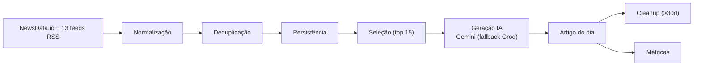

# Newra News

> Portal de notícias com **artigo diário gerado por IA** — organiza o excesso de notícias do dia em uma leitura confiável, em português, produzida automaticamente a partir de centenas de fontes brasileiras e internacionais.

[](https://github.com/tavinholoco/newra-news/actions/workflows/ci.yml)


[](LICENSE)

**[🌐 Ver em produção](https://newra-news-web.vercel.app)** · **[📖 Documentação](docs/)** · **[🐛 Reportar bug](https://github.com/tavinholoco/newra-news/issues)**

## 💡 Por que o Newra existe

Acompanhar notícias hoje significa navegar por dezenas de fontes diferentes sem saber quais realmente importam. O Newra resolve isso com um pipeline automático que coleta centenas de notícias por dia, remove duplicatas e gera um artigo diário — com fontes citadas e transparência sobre o uso de IA — para que o leitor tenha uma síntese confiável do que aconteceu, em poucos minutos.

## ✨ Funcionalidades

- **Pipeline diário automático** — coleta notícias (NewsData.io + 13 feeds RSS), deduplica, e gera o artigo do dia via **Gemini** (com fallback **Groq**)
- **8 categorias** — TECHNOLOGY, POLITICS, ECONOMY, SPORTS, SCIENCE, ENTERTAINMENT, WORLD e HEALTH, com classificação por palavras-chave nos feeds RSS
- **Home com feed de notícias** e artigo do dia em destaque
- **Busca e filtros por categoria** em tempo real (TanStack Query)
- **Histórico de artigos diários** — navegue por data
- **Contas e favoritos** — login social (Google/GitHub) e notícias salvas por usuário
- **Newsletter diária** — inscrição pelo rodapé, envio junto do pipeline (Resend) e página de cancelamento
- **i18n pt-BR/en** — next-intl com rotas `/pt-BR` e `/en` (seletor no header, SSG/ISR por idioma)
- **SEO completo** — sitemap automático, Open Graph, meta tags dinâmicas localizadas
- **Mobile-first** com Tailwind CSS + shadcn/ui
- **Dark mode** com toggle e preferência do sistema
- **Métricas em produção** — painel `/api/metrics/*` com contagens por provider e categoria

## 🏗️ Arquitetura do pipeline



Disparado às 08:00 BRT (Vercel Cron às 11:00 UTC + cron interno do Fastify como fallback). Diagramas completos (arquitetura, ER, sequência) em [`docs/diagrams/`](docs/diagrams).

## 📸 Screenshots

| Home | Notícias | Artigo do dia |
|---|---|---|
| [](docs/screenshots/home.png) | [](docs/screenshots/news.png) | [](docs/screenshots/article.png) |

## 🧱 Stack

- **Frontend:** Next.js 14 (App Router) + Tailwind CSS + shadcn/ui
- **Backend:** Fastify + TypeScript + Prisma + Zod
- **Database:** PostgreSQL (Neon em produção, Docker local)
- **IA:** Google Gemini (principal) + Groq (fallback)
- **Notícias:** NewsData.io + RSS feeds
- **Monorepo:** Turborepo + pnpm workspaces
- **CI/CD:** GitHub Actions (lint, typecheck, testes com cobertura >70%, Lighthouse semanal)

## 🚀 Quick Start

Requisitos: Node >= 22, pnpm 9 e Docker.

```bash
# 1. Instalar dependências
pnpm install

# 2. Configurar env vars (ver docs/setup.md §3)
cp .env.example .env
cp apps/api/.env.example apps/api/.env
cp apps/web/.env.example apps/web/.env.local

# 3. Subir o banco (PostgreSQL + pgAdmin)
docker compose up -d
pnpm db:generate
pnpm db:migrate
pnpm db:seed          # opcional: dados realistas

# 4. Rodar em dev
pnpm dev              # web → localhost:3000 · api → localhost:3001
```

## 🔧 Scripts

| Comando | Descrição |
|---|---|
| `pnpm dev` | Sobe web + api em modo desenvolvimento |
| `pnpm build` | Build de produção (monorepo) |
| `pnpm lint` | ESLint em todo o monorepo |
| `pnpm test` | Vitest (backend + frontend) |
| `pnpm --filter @newranews/api test:coverage` | Testes com cobertura (threshold 70%) |
| `pnpm db:generate` | Gera o Prisma Client |
| `pnpm db:migrate` | Roda migrations Prisma |
| `pnpm db:studio` | Abre o Prisma Studio |
| `pnpm --filter @newranews/web lighthouse:audit` | Auditoria Lighthouse contra a produção |

## 📁 Estrutura

```
newranews/
├── apps/
│   ├── web/          # Frontend — Next.js 14
│   └── api/          # Backend — Fastify
├── packages/
│   ├── database/     # Prisma ORM (schema + client)
│   ├── types/        # Types TypeScript compartilhados
│   ├── eslint-config/# Configs ESLint
│   └── tsconfig/     # TSConfigs base
├── docs/             # Documentação + diagramas
└── docker-compose.yml
```

## 📚 Documentação

- [Setup Guide](docs/setup.md) — ambiente local passo a passo
- [Architecture](docs/architecture.md) — arquitetura e pipeline
- [API Guide](docs/api.md) — todos os endpoints
- [Diagrams](docs/diagrams) — diagramas Mermaid (arquitetura, ER, sequência, fluxo)

## 🗺️ Roadmap

O Newra está em evolução ativa. O plano da próxima versão do frontend (redesign editorial, personalização, monetização, novas migrations e reestruturação do backend em módulos) está documentado em [`docs/Newra-News-V2-Frontend-Redesign-Plan.md`](docs/Newra-News-V2-Frontend-Redesign-Plan.md).

## 🤝 Contributing

Contribuições são bem-vindas. O fluxo básico:

```bash
git checkout -b feat/minha-mudanca
pnpm test
# abra o PR descrevendo objetivo, screenshots (se visual) e impacto em performance
```

Guia completo (branches, convenção de commits, checklist de PR) em [CONTRIBUTING.md](CONTRIBUTING.md).

## 🌐 Produção

- **Site:** [newra-news-web.vercel.app](https://newra-news-web.vercel.app)
- **API:** [newra-news-api.onrender.com](https://newra-news-api.onrender.com) (Swagger em `/api/docs`)

## 📄 Licença

[MIT](LICENSE) © Pedro Levi
