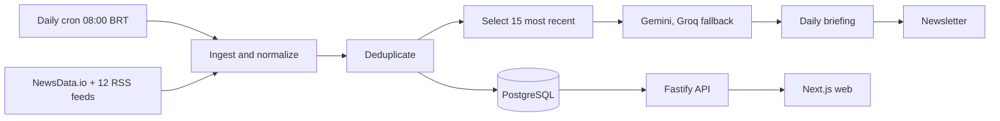

# Newra News

AI-generated daily briefing that turns hundreds of news sources into one reliable read, in Portuguese and English.

[](https://github.com/tavinholoco/newra-news/actions/workflows/ci.yml)


**English** | [Português](README.pt-BR.md)

[Live demo](https://newra-news-web.vercel.app) · [API reference](docs/api.md) · [Documentation](docs/)

## Table of Contents

- [Screenshots](#screenshots)
- [About](#about)
- [Features](#features)
- [Tech Stack](#tech-stack)
- [Architecture](#architecture)
- [Project Structure](#project-structure)
- [Getting Started](#getting-started)
- [Scripts](#scripts)
- [Tests](#tests)
- [Deploy](#deploy)
- [Roadmap](#roadmap)
- [Contributing](#contributing)
- [License](#license)
- [Author](#author)

## Screenshots

| Home | News archive | Daily briefing |
| --- | --- | --- |
| [](docs/v2/baseline-v2/home--1440.jpg) | [](docs/v2/baseline-v2/news--1440.jpg) | [](docs/v2/baseline-v2/article-detail--1440.jpg) |

Captured from production at 1440px. The full set — 12 routes across three widths, plus dark mode — is in [`docs/v2/baseline-v2/`](docs/v2/baseline-v2).

## About

Following the news means opening a dozen sites and still not knowing what mattered. The volume is not the reader's problem to solve, but it is the one every feed hands them.

Newra News collects hundreds of articles a day from NewsData.io and twelve Brazilian and international RSS feeds, removes duplicates, and writes a single daily briefing from the fifteen most recent stories. Every briefing cites the articles it was built from and states, on the page, that it was generated by AI. The archive stays browsable by date, category, and full-text search.

The point is not the automation — it is that a reader can trust what comes out of it. Sources are named, the generation date is visible, the model is disclosed, and everything the pipeline touched is still one click away.

## Features

- **Daily briefing generated by AI** — Gemini as the primary model, Groq as the fallback, with cited sources and an explicit AI-generation notice
- **Automated ingestion pipeline** — NewsData.io plus twelve RSS feeds, normalized, deduplicated by source URL, and cleaned up after 30 days
- **Eight categories** — technology, politics, economy, sports, science, entertainment, world, and health, classified by keyword
- **Search and category filters** with results kept in the URL
- **Archive browsable by date** for every past briefing
- **Accounts and favourites** — Google and GitHub sign-in, saved news and briefings per user
- **Newsletter** — subscription from the footer, unsubscribe page, and a delivery stage in the daily pipeline
- **Bilingual pt-BR and en** — localized routes, metadata, and static generation per locale
- **SEO** — sitemap, news sitemap, Open Graph images, and localized metadata per route
- **Dark mode** following the system preference, with a manual toggle
- **Admin metrics panel** — pipeline runs, ingestion counts by provider and category, restricted to the ADMIN role

## Tech Stack

| Layer | Technologies |
| --- | --- |
| Frontend | Next.js 14.2 (App Router), React 18.3, TypeScript 5.9, Tailwind CSS 4.2, Base UI, TanStack Query 5.90, next-intl 3.26 |
| Backend | Fastify 4.29, Node.js 22, TypeScript 5.9, Zod 3.25, next-auth 4.24 with a JWT shared between both apps |
| Database | PostgreSQL 16, Prisma ORM 5.22 |
| AI and data | Google Gemini (primary), Groq (fallback), NewsData.io, RSS feeds, Resend |
| Quality | Vitest 2.1, Testing Library, Playwright 1.62, ESLint, Prettier, Gitleaks, Lighthouse CI |
| Infra | Turborepo, pnpm workspaces, Vercel, Render, Neon, GitHub Actions |

## Architecture



The pipeline runs once a day at 08:00 BRT, triggered by a Vercel Cron job that wakes the API with a health check before firing. An internal Fastify scheduler points at the same instant, but it only runs if the process happens to be up — on the free tier it often is not, so it is a happy path rather than a safety net. It is idempotent per day: a second trigger on a day that already succeeded reports that it did nothing rather than running again. The web app reads the API through static generation with ISR, so a page that has already been built stays up even while the API is unavailable.

Six full diagrams are in [`docs/diagrams/`](docs/diagrams): system architecture, frontend route map, session and authorization flow, entity relationships, pipeline sequence, and daily data flow.

## Project Structure

```
newra-news/
├── apps/
│   ├── web/              # Frontend — Next.js 14 (App Router)
│   └── api/              # Backend — Fastify + TypeScript
├── packages/
│   ├── database/         # Prisma schema, client, migrations, seed
│   ├── types/            # TypeScript types shared across apps
│   ├── eslint-config/    # Shared ESLint configuration
│   └── tsconfig/         # Base TypeScript configuration
├── docs/                 # Setup, architecture, API, diagrams, V2 plan
├── scripts/              # Local bootstrap and asset generation
└── docker-compose.yml    # PostgreSQL 16 + pgAdmin for local development
```

## Getting Started

### Prerequisites

- Node.js 22 or newer
- pnpm 9
- Docker (for the local PostgreSQL instance)

### Installation

```bash
git clone https://github.com/tavinholoco/newra-news.git
cd newra-news
pnpm install
```

### Environment variables

Three files, one per scope. Copy each example and fill it in — no real values are committed.

```bash
cp .env.example .env
cp apps/api/.env.example apps/api/.env
cp apps/web/.env.example apps/web/.env.local
```

Root — `.env`:

| Variable | Description | Required |
| --- | --- | --- |
| `DATABASE_URL` | PostgreSQL connection string used by Prisma | Yes |

Backend — `apps/api/.env`:

| Variable | Description | Required |
| --- | --- | --- |
| `DATABASE_URL` | PostgreSQL connection string | Yes |
| `GEMINI_API_KEY` | Google Gemini key, the primary model for the briefing | Yes |
| `GROQ_API_KEY` | Groq key, used when Gemini fails | Yes |
| `JOB_SECRET` | Shared secret that authorizes the pipeline trigger endpoint | Yes |
| `AUTH_JWT_SECRET` | Secret shared with the web app, which signs the JWTs the API validates. Must be identical in both | Yes for accounts |
| `NEWSDATA_API_KEY` | NewsData.io key. Without it the pipeline runs on RSS feeds only | No |
| `PORT` | API port. Defaults to `3001` | No |
| `HOST` | Bind address. Defaults to `0.0.0.0` | No |
| `NODE_ENV` | `development`, `production`, or `test` | No |
| `CORS_ORIGIN` | Allowed origin. Defaults to `http://localhost:3000` | No |
| `API_PUBLIC_URL` | Public API address announced by the OpenAPI document | No |
| `GEMINI_MODEL` | Gemini model id. Defaults to `gemini-2.5-flash` | No |
| `GROQ_MODEL` | Groq model id. Defaults to `openai/gpt-oss-20b` | No |
| `CRON_SCHEDULE` | Internal scheduler expression. Defaults to `0 8 * * *` | No |
| `CRON_TIMEZONE` | Scheduler timezone. Defaults to `America/Sao_Paulo` | No |
| `RESEND_API_KEY` | Resend key. Without it the newsletter step is skipped | No |
| `SITE_URL` | Public frontend URL used in newsletter links | No |
| `NEWSLETTER_FROM` | Sender address, on a domain verified in Resend | No |
| `ADMIN_EMAILS` | Comma-separated emails that get the ADMIN role on sign-up | No |

Frontend — `apps/web/.env.local`:

| Variable | Description | Required |
| --- | --- | --- |
| `NEXT_PUBLIC_API_URL` | API base URL. Defaults to `http://localhost:3001/api` | Yes in production |
| `NEXTAUTH_SECRET` | next-auth session secret | Yes for accounts |
| `AUTH_JWT_SECRET` | Same value as the API variable of the same name | Yes for accounts |
| `NEXTAUTH_URL` | Site base URL, required for OAuth in production | Yes in production |
| `NEXT_PUBLIC_SITE_URL` | Public URL used in SEO metadata. Derived from Vercel when absent | No |
| `GOOGLE_CLIENT_ID` | Google OAuth client id | No |
| `GOOGLE_CLIENT_SECRET` | Google OAuth client secret | No |
| `GITHUB_CLIENT_ID` | GitHub OAuth client id | No |
| `GITHUB_CLIENT_SECRET` | GitHub OAuth client secret | No |
| `CRON_SECRET` | Token Vercel injects to authorize the cron route | No |
| `BACKEND_JOB_URL` | Pipeline endpoint the cron route calls | No |
| `BACKEND_JOB_SECRET` | Secret sent to that endpoint. Matches `JOB_SECRET` | No |

### Database

```bash
docker compose up -d
pnpm db:generate
pnpm db:migrate
pnpm db:seed
```

### Running

```bash
pnpm dev
```

The web app runs on `http://localhost:3000` and the API on `http://localhost:3001`. On a fresh machine, `./scripts/dev-bootstrap.sh` does every step above in one idempotent run.

## Scripts

| Command | Description |
| --- | --- |
| `pnpm dev` | Runs web and API in development mode |
| `pnpm build` | Production build across the monorepo |
| `pnpm lint` | ESLint across the monorepo |
| `pnpm test` | Vitest for backend and frontend. Needs no database |
| `pnpm db:generate` | Generates the Prisma client |
| `pnpm db:migrate` | Applies Prisma migrations in development |
| `pnpm db:migrate:deploy` | Applies pending migrations without prompting |
| `pnpm db:migrate:status` | Shows which migrations are applied |
| `pnpm db:studio` | Opens Prisma Studio |
| `pnpm db:seed` | Seeds the database with realistic data |
| `pnpm --filter @newranews/api test:coverage` | API tests with the coverage threshold |
| `pnpm --filter @newranews/web test:coverage` | Web tests with the coverage threshold |
| `pnpm --filter @newranews/api archive:hygiene` | Measures text hygiene of the archive against production |
| `pnpm --filter @newranews/web test:e2e` | Playwright end-to-end specs |
| `pnpm --filter @newranews/web visual:baseline` | Captures the visual baseline of the public routes |
| `pnpm --filter @newranews/web lighthouse:audit` | Lighthouse audit against production |

## Tests

```bash
pnpm test
```

**1,409 unit and integration tests across 127 suites** — 804 for the API in 61 suites, 605 for the web app in 66. The suite needs no database and no network: the backend uses `fastify.inject()`, the frontend uses Testing Library on jsdom. Coverage is enforced at a 70% floor for lines, statements, functions, and branches in both apps, and CI fails below it.

End-to-end coverage is separate: **29 Playwright specs across 5 files**, covering the visitor, archive, account, newsletter, and authorization flows. They run against production through the `Smoke E2E` workflow on every push to `main`, and are deliberately not part of `pnpm test`.

```bash
pnpm --filter @newranews/web test:e2e
```

## Deploy

| Component | Where | How |
| --- | --- | --- |
| Web | Vercel | Deploys on push to `main`. Static generation with ISR, plus a cron job hitting `/api/cron/daily-news` at 11:00 UTC |
| API | Render | `render.yaml` blueprint, free plan, health check at `/api/health` |
| Database | Neon | Managed PostgreSQL. Migrations applied by the `Migrate` workflow, never from a local machine |

Five GitHub Actions workflows back this up: `CI` (lint, tests with coverage, build), `Gitleaks` (secret scanning), `Smoke E2E` (production flows after each deploy), `Lighthouse CI` (weekly, failing below 90 in any category), and `Migrate`.

The interactive Swagger UI is served in development only, at `/api/docs`. In production the OpenAPI document is still generated, but the UI is not registered — the contract lives in [`docs/api.md`](docs/api.md), guarded against drift by a test.

## Roadmap

- [x] V1 — pipeline, daily briefing, news feed, search, and categories
- [x] Accounts, favourites, newsletter, and the admin metrics panel
- [x] Bilingual pt-BR and en with localized SEO
- [x] V2 editorial redesign — design tokens, reading screens, integration, and visual refinement
- [ ] Final release — recaptured visual baseline, changelog, and first tag
- [ ] Verify the sending domain in Resend so the newsletter reaches real subscribers
- [ ] AI-based category classification, replacing the keyword classifier
- [ ] Analytics opt-out in the interface
- [ ] Next.js 15 and Fastify 5

The V2 plan is documented in [`docs/Newra-News-V2-Frontend-Redesign-Plan.md`](docs/Newra-News-V2-Frontend-Redesign-Plan.md), and the phase-by-phase history in [`docs/progress.md`](docs/progress.md).

## Contributing

Contributions are welcome.

```bash
git checkout -b feat/my-change
pnpm test
```

Branch naming, commit conventions, and the pull request checklist are in [CONTRIBUTING.md](CONTRIBUTING.md). Local setup, environment variables, and troubleshooting are in [`docs/setup.md`](docs/setup.md).

## License

Distributed under the MIT License. See [LICENSE](LICENSE) for details.

## Author

**Pedro Levi Dias** — Fullstack Developer

[GitHub](https://github.com/tavinholoco) · [LinkedIn](https://www.linkedin.com/in/pedro-levi-dias-96720126a/) · [Portfolio](https://portfolio-tau-five-f86nc5khr8.vercel.app/)
