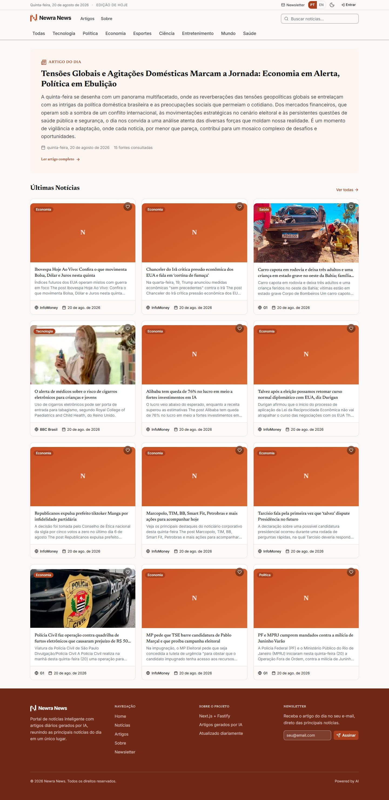
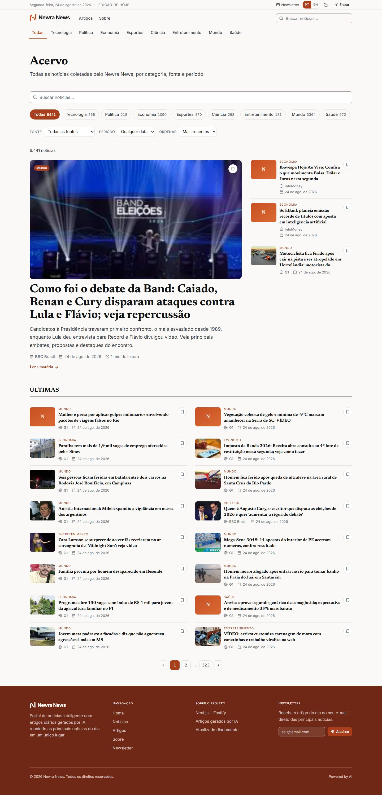
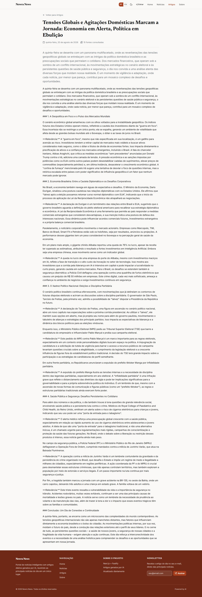
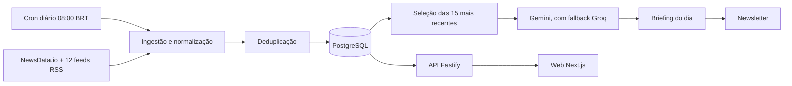

# Newra News

Briefing diário gerado por IA que transforma centenas de fontes de notícias em uma leitura confiável, em português e inglês.

[](https://github.com/tavinholoco/newra-news/actions/workflows/ci.yml)


[English](README.md) | **Português**

[Ver em produção](https://newra-news-web.vercel.app) · [Referência da API](docs/api.md) · [Documentação](docs/)

## Índice

- [Telas](#telas)
- [Sobre](#sobre)
- [Funcionalidades](#funcionalidades)
- [Stack](#stack)
- [Arquitetura](#arquitetura)
- [Estrutura do projeto](#estrutura-do-projeto)
- [Como rodar localmente](#como-rodar-localmente)
- [Scripts](#scripts)
- [Testes](#testes)
- [Deploy](#deploy)
- [Roadmap](#roadmap)
- [Contribuindo](#contribuindo)
- [Licença](#licença)
- [Autor](#autor)

## Telas

| Home | Acervo de notícias | Briefing do dia |
| --- | --- | --- |
| [](docs/v2/baseline-v2/home--1440.jpg) | [](docs/v2/baseline-v2/news--1440.jpg) | [](docs/v2/baseline-v2/article-detail--1440.jpg) |

Capturas de produção a 1440px. O conjunto completo — 12 rotas em três larguras, mais o modo escuro — está em [`docs/v2/baseline-v2/`](docs/v2/baseline-v2).

## Sobre

Acompanhar notícias significa abrir uma dezena de sites e ainda assim não saber o que importou. O volume não é problema que o leitor deveria resolver, mas é o que todo feed entrega a ele.

O Newra News coleta centenas de matérias por dia da NewsData.io e de doze feeds RSS brasileiros e internacionais, remove duplicatas e escreve um único briefing diário a partir das quinze matérias mais recentes. Todo briefing cita os artigos que o originaram e declara, na própria página, que foi gerado por IA. O acervo continua navegável por data, por categoria e por busca textual.

O ponto não é a automação — é que o leitor possa confiar no que sai dela. As fontes são nomeadas, a data de geração fica visível, o modelo é declarado, e tudo o que o pipeline tocou continua a um clique de distância.

## Funcionalidades

- **Briefing diário gerado por IA** — Gemini como modelo principal e Groq como fallback, com fontes citadas e aviso explícito de geração por IA
- **Pipeline de ingestão automático** — NewsData.io mais doze feeds RSS, normalizados, deduplicados por URL de origem e expurgados após 30 dias
- **Oito categorias** — tecnologia, política, economia, esportes, ciência, entretenimento, mundo e saúde, classificadas por palavra-chave
- **Busca e filtros por categoria** com o recorte preservado na URL
- **Acervo navegável por data** para todos os briefings anteriores
- **Contas e favoritos** — login com Google e GitHub, notícias e briefings salvos por usuário
- **Newsletter** — inscrição pelo rodapé, página de cancelamento e etapa de envio no pipeline diário
- **Bilíngue pt-BR e en** — rotas, metadados e geração estática por idioma
- **SEO** — sitemap, news sitemap, imagens de Open Graph e metadados localizados por rota
- **Modo escuro** seguindo a preferência do sistema, com alternância manual
- **Painel de métricas** — execuções do pipeline e contagens de ingestão por provider e categoria, restrito ao papel ADMIN

## Stack

| Camada | Tecnologias |
| --- | --- |
| Frontend | Next.js 14.2 (App Router), React 18.3, TypeScript 5.9, Tailwind CSS 4.2, Base UI, TanStack Query 5.90, next-intl 3.26 |
| Backend | Fastify 4.29, Node.js 22, TypeScript 5.9, Zod 3.25, next-auth 4.24 com JWT compartilhado entre os dois apps |
| Banco | PostgreSQL 16, Prisma ORM 5.22 |
| IA e dados | Google Gemini (principal), Groq (fallback), NewsData.io, feeds RSS, Resend |
| Qualidade | Vitest 2.1, Testing Library, Playwright 1.62, ESLint, Prettier, Gitleaks, Lighthouse CI |
| Infra | Turborepo, pnpm workspaces, Vercel, Render, Neon, GitHub Actions |

## Arquitetura



O pipeline roda uma vez por dia às 08:00 BRT, disparado por um cron da Vercel com um agendador interno do Fastify como fallback. Ele é idempotente por dia: um segundo disparo num dia que já teve sucesso informa que não fez nada, em vez de rodar de novo. O web lê a API por geração estática com ISR, então uma página já construída continua no ar mesmo enquanto a API está indisponível.

Os diagramas completos — arquitetura do sistema, entidade-relacionamento, sequência do pipeline e fluxo de dados — estão em [`docs/diagrams/`](docs/diagrams).

## Estrutura do projeto

```
newra-news/
├── apps/
│   ├── web/              # Frontend — Next.js 14 (App Router)
│   └── api/              # Backend — Fastify + TypeScript
├── packages/
│   ├── database/         # Schema, client, migrations e seed do Prisma
│   ├── types/            # Types TypeScript compartilhados entre os apps
│   ├── eslint-config/    # Configuração ESLint compartilhada
│   └── tsconfig/         # Configuração base do TypeScript
├── docs/                 # Setup, arquitetura, API, diagramas, plano V2
├── scripts/              # Bootstrap local e geração de assets
└── docker-compose.yml    # PostgreSQL 16 + pgAdmin para desenvolvimento
```

## Como rodar localmente

### Pré-requisitos

- Node.js 22 ou superior
- pnpm 9
- Docker (para o PostgreSQL local)

### Instalação

```bash
git clone https://github.com/tavinholoco/newra-news.git
cd newra-news
pnpm install
```

### Variáveis de ambiente

Três arquivos, um por escopo. Copie cada exemplo e preencha — nenhum valor real é versionado.

```bash
cp .env.example .env
cp apps/api/.env.example apps/api/.env
cp apps/web/.env.example apps/web/.env.local
```

Raiz — `.env`:

| Variável | Descrição | Obrigatória |
| --- | --- | --- |
| `DATABASE_URL` | String de conexão do PostgreSQL usada pelo Prisma | Sim |

Backend — `apps/api/.env`:

| Variável | Descrição | Obrigatória |
| --- | --- | --- |
| `DATABASE_URL` | String de conexão do PostgreSQL | Sim |
| `GEMINI_API_KEY` | Chave do Google Gemini, modelo principal do briefing | Sim |
| `GROQ_API_KEY` | Chave da Groq, usada quando o Gemini falha | Sim |
| `JOB_SECRET` | Segredo que autoriza o endpoint de disparo do pipeline | Sim |
| `AUTH_JWT_SECRET` | Segredo compartilhado com o web, que assina os JWTs validados pela API. Deve ser idêntico nos dois | Sim para contas |
| `NEWSDATA_API_KEY` | Chave da NewsData.io. Sem ela o pipeline roda só com os feeds RSS | Não |
| `PORT` | Porta da API. Padrão `3001` | Não |
| `HOST` | Endereço de bind. Padrão `0.0.0.0` | Não |
| `NODE_ENV` | `development`, `production` ou `test` | Não |
| `CORS_ORIGIN` | Origem permitida. Padrão `http://localhost:3000` | Não |
| `API_PUBLIC_URL` | Endereço público anunciado pelo documento OpenAPI | Não |
| `GEMINI_MODEL` | Id do modelo Gemini. Padrão `gemini-2.5-flash` | Não |
| `GROQ_MODEL` | Id do modelo Groq. Padrão `openai/gpt-oss-20b` | Não |
| `CRON_SCHEDULE` | Expressão do agendador interno. Padrão `0 8 * * *` | Não |
| `CRON_TIMEZONE` | Fuso do agendador. Padrão `America/Sao_Paulo` | Não |
| `RESEND_API_KEY` | Chave do Resend. Sem ela a etapa de newsletter é pulada | Não |
| `SITE_URL` | URL pública do frontend, usada nos links do e-mail | Não |
| `NEWSLETTER_FROM` | Remetente, em domínio verificado no Resend | Não |
| `ADMIN_EMAILS` | E-mails que nascem com o papel ADMIN, separados por vírgula | Não |

Frontend — `apps/web/.env.local`:

| Variável | Descrição | Obrigatória |
| --- | --- | --- |
| `NEXT_PUBLIC_API_URL` | URL base da API. Padrão `http://localhost:3001/api` | Sim em produção |
| `NEXTAUTH_SECRET` | Segredo de sessão do next-auth | Sim para contas |
| `AUTH_JWT_SECRET` | Mesmo valor da variável homônima da API | Sim para contas |
| `NEXTAUTH_URL` | URL base do site, obrigatória para OAuth em produção | Sim em produção |
| `NEXT_PUBLIC_SITE_URL` | URL pública usada nos metadados de SEO. Derivada da Vercel quando ausente | Não |
| `GOOGLE_CLIENT_ID` | Client id do OAuth do Google | Não |
| `GOOGLE_CLIENT_SECRET` | Client secret do OAuth do Google | Não |
| `GITHUB_CLIENT_ID` | Client id do OAuth do GitHub | Não |
| `GITHUB_CLIENT_SECRET` | Client secret do OAuth do GitHub | Não |
| `CRON_SECRET` | Token que a Vercel injeta para autorizar a rota de cron | Não |
| `BACKEND_JOB_URL` | Endpoint do pipeline chamado pela rota de cron | Não |
| `BACKEND_JOB_SECRET` | Segredo enviado a esse endpoint. Corresponde ao `JOB_SECRET` | Não |

### Banco de dados

```bash
docker compose up -d
pnpm db:generate
pnpm db:migrate
pnpm db:seed
```

### Execução

```bash
pnpm dev
```

O web sobe em `http://localhost:3000` e a API em `http://localhost:3001`. Em máquina nova, `./scripts/dev-bootstrap.sh` faz todos os passos acima numa execução idempotente.

## Scripts

| Comando | Descrição |
| --- | --- |
| `pnpm dev` | Sobe web e API em modo desenvolvimento |
| `pnpm build` | Build de produção do monorepo |
| `pnpm lint` | ESLint em todo o monorepo |
| `pnpm test` | Vitest no backend e no frontend. Não precisa de banco |
| `pnpm db:generate` | Gera o Prisma Client |
| `pnpm db:migrate` | Aplica as migrations Prisma em desenvolvimento |
| `pnpm db:migrate:deploy` | Aplica as migrations pendentes sem prompt |
| `pnpm db:migrate:status` | Mostra quais migrations estão aplicadas |
| `pnpm db:studio` | Abre o Prisma Studio |
| `pnpm db:seed` | Popula o banco com dados realistas |
| `pnpm --filter @newranews/api test:coverage` | Testes da API com o piso de cobertura |
| `pnpm --filter @newranews/web test:coverage` | Testes do web com o piso de cobertura |
| `pnpm --filter @newranews/api archive:hygiene` | Mede a higiene de texto do acervo contra produção |
| `pnpm --filter @newranews/web test:e2e` | Specs end-to-end do Playwright |
| `pnpm --filter @newranews/web visual:baseline` | Captura a baseline visual das rotas públicas |
| `pnpm --filter @newranews/web lighthouse:audit` | Auditoria Lighthouse contra produção |

## Testes

```bash
pnpm test
```

**1.399 testes de unidade e integração em 126 suítes** — 794 da API em 60 suítes e 605 do web em 66. A suíte não precisa de banco nem de rede: o backend usa `fastify.inject()` e o frontend usa Testing Library sobre jsdom. A cobertura tem piso de 70% em linhas, statements, funções e branches nos dois apps, e o CI reprova abaixo disso.

A cobertura end-to-end é separada: **29 specs de Playwright em 5 arquivos**, cobrindo os fluxos de visitante, acervo, conta, newsletter e autorização. Elas rodam contra produção pelo workflow `Smoke E2E` a cada push na `main`, e propositalmente não fazem parte do `pnpm test`.

```bash
pnpm --filter @newranews/web test:e2e
```

## Deploy

| Componente | Onde | Como |
| --- | --- | --- |
| Web | Vercel | Deploy a cada push na `main`. Geração estática com ISR, mais um cron que chama `/api/cron/daily-news` às 11:00 UTC |
| API | Render | Blueprint `render.yaml`, plano free, health check em `/api/health` |
| Banco | Neon | PostgreSQL gerenciado. Migrations aplicadas pelo workflow `Migrate`, nunca de máquina local |

Seis workflows do GitHub Actions sustentam isso: `CI` (lint, testes com cobertura, build), `Gitleaks` (varredura de segredos), `Smoke E2E` (fluxos em produção depois de cada deploy), `Lighthouse CI` (semanal, reprovando abaixo de 90 em qualquer categoria), `Migrate` e `Keep-alive` (que mantém a API acordada entre 06:00 e 00:00 BRT e a deixa dormir de madrugada, para caber nas horas mensais do plano gratuito).

A UI interativa do Swagger é servida apenas em desenvolvimento, em `/api/docs`. Em produção o documento OpenAPI continua sendo gerado, mas a UI não é registrada — o contrato é a [`docs/api.md`](docs/api.md), guardada contra deriva por um teste.

## Roadmap

- [x] V1 — pipeline, briefing diário, feed de notícias, busca e categorias
- [x] Contas, favoritos, newsletter e painel de métricas
- [x] Bilíngue pt-BR e en com SEO localizado
- [x] Redesign editorial V2 — tokens de design, telas de leitura, integração e refinamento visual
- [ ] Release final — baseline visual recapturada, changelog e primeira tag
- [ ] Verificar o domínio de envio no Resend para a newsletter alcançar inscritos reais
- [ ] Classificação de categoria por IA, no lugar do classificador por palavra-chave
- [ ] Opt-out de analytics na interface
- [ ] Next.js 15 e Fastify 5

O plano da V2 está em [`docs/Newra-News-V2-Frontend-Redesign-Plan.md`](docs/Newra-News-V2-Frontend-Redesign-Plan.md), e o histórico fase a fase em [`docs/progress.md`](docs/progress.md).

## Contribuindo

Contribuições são bem-vindas.

```bash
git checkout -b feat/minha-mudanca
pnpm test
```

Nomenclatura de branches, convenção de commits e o checklist de pull request estão em [CONTRIBUTING.md](CONTRIBUTING.md). O setup local, as variáveis de ambiente e o troubleshooting estão em [`docs/setup.md`](docs/setup.md).

## Licença

Distribuído sob a Licença MIT. Veja [LICENSE](LICENSE) para os detalhes.

## Autor

**Pedro Levi Dias** — Desenvolvedor Fullstack

[GitHub](https://github.com/tavinholoco) · [LinkedIn](https://www.linkedin.com/in/pedro-levi-dias-96720126a/) · [Portfólio](https://portfolio-tau-five-f86nc5khr8.vercel.app/)
